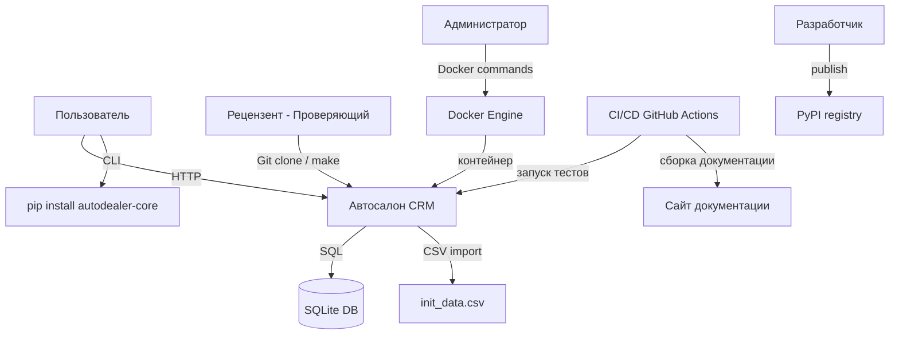
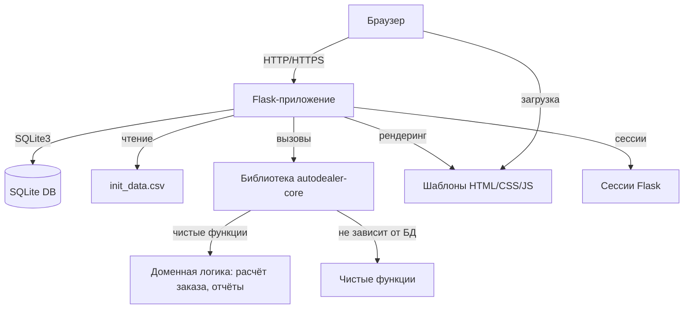
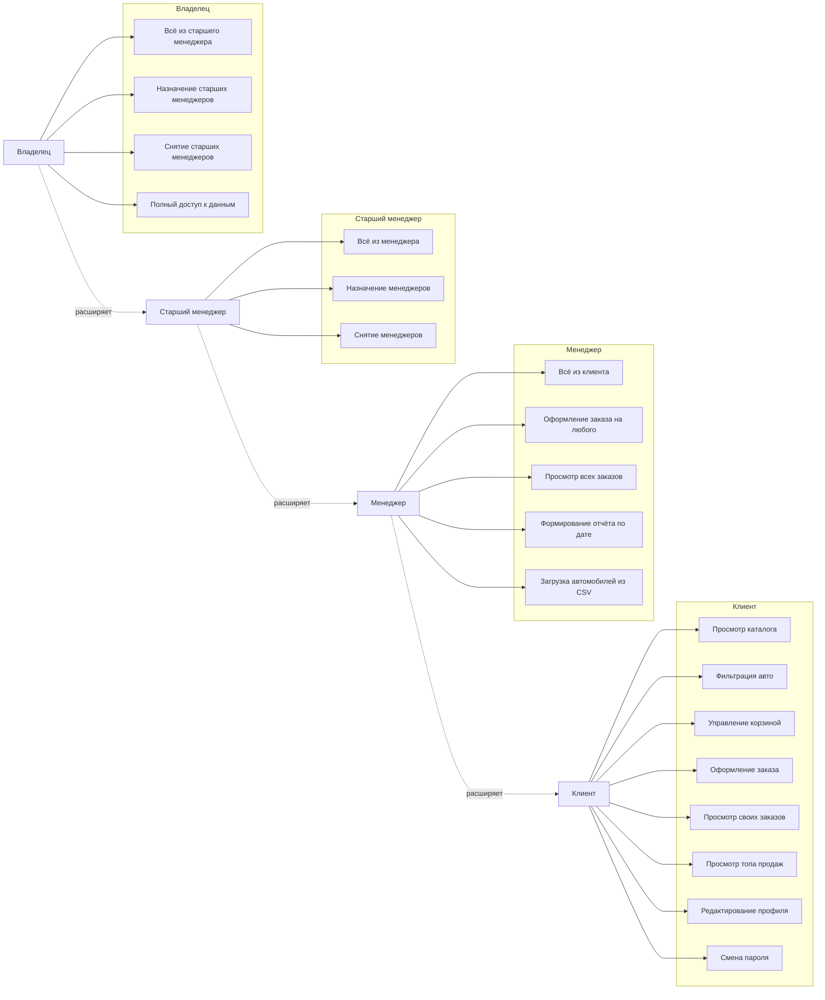
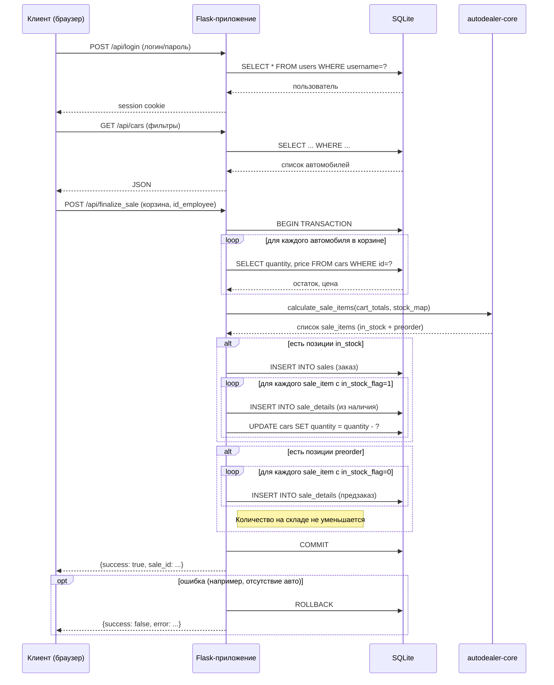

# Архитектурное описание

## 1. Контекстная диаграмма (C4 level 1)

Система представляет собой веб-приложение, которое взаимодействует с базой данных SQLite и может загружать начальные данные из CSV. Пользователи обращаются через браузер. Библиотека `autodealer-core` может использоваться отдельно (например, в CLI). Администратор управляет развёртыванием через Docker.

## 2. Диаграмма контейнеров (C4 level 2)

Flask-приложение – содержит маршруты API, аутентификацию, работу с БД.

SQLite DB – хранит данные о пользователях, автомобилях, заказах.

Библиотека autodealer-core – независимый пакет, опубликованный на PyPI. Содержит чистое доменное поведение.

CSV-файл – используется для инициализации справочников и тестовых данных.

## 3. Use case диаграмма (основные сценарии)

## 4. Диаграмма последовательности для сценария «Оформление заказа»

## 5. Принятые архитектурные решения

| Решение | Обоснование |
|---------|-------------|
| Выделение `autodealer-core` в отдельную библиотеку | Переиспользование доменной логики в CLI, Telegram-боте и других интерфейсах. Публикация на PyPI. |
| Использование SQLite | Простота, не требует отдельного сервера, достаточно для учебного проекта. Данные сохраняются в одном файле. |
| Flask без сложных расширений | Минимализм, легкость, быстрая разработка. |
| Ролевая модель через декораторы | Чёткое разделение прав, легко расширять. |
| Контейнеризация (Docker, Compose) | Воспроизводимость, один запуск для проверяющего. |
| Makefile для автоматизации | Единые команды для всех операций: установка, запуск, тесты, документация. |
| Тестирование pytest + покрытие | Защита от регрессий, документация поведения. |
| MkDocs + Mermaid | Автоматическая сборка документации с диаграммами, хранение исходников в репозитории. |

## 6. Используемые инструменты разработки

| Инструмент | Назначение |
|------------|------------|
| Python 3.11 | Язык программирования |
| Flask | Web-фреймворк |
| SQLite | База данных |
| pytest | Тестирование |
| pytest-cov | Покрытие кода |
| flake8 | Линтер |
| MkDocs + Material | Генератор статической документации |
| Docker, Compose | Контейнеризация |
| Make | Автоматизация команд |
| Git | Контроль версий |